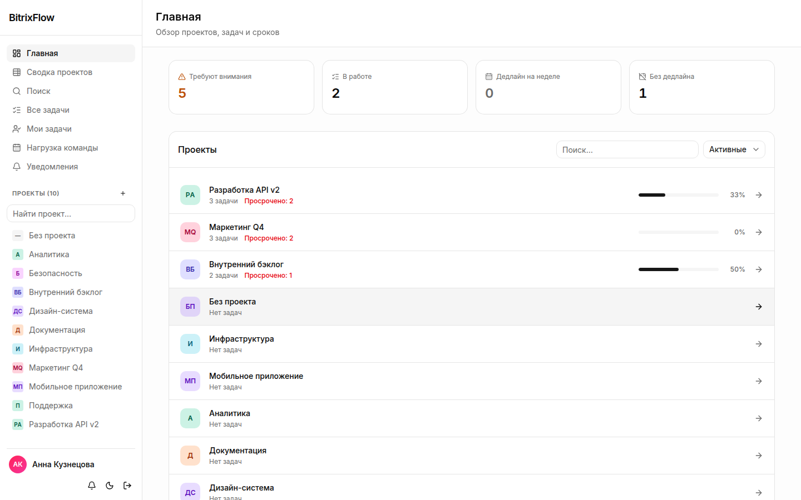
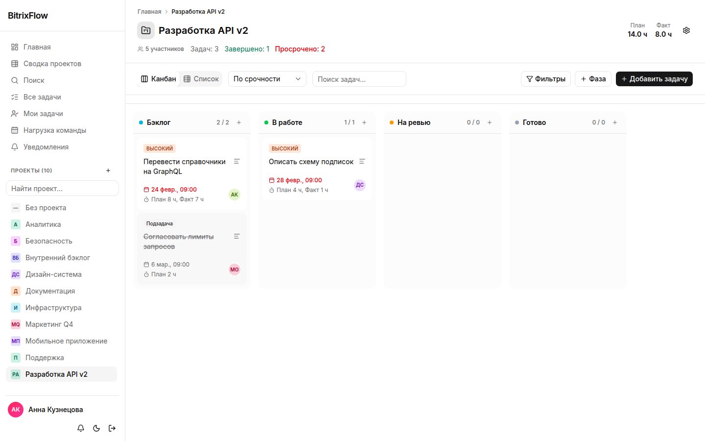
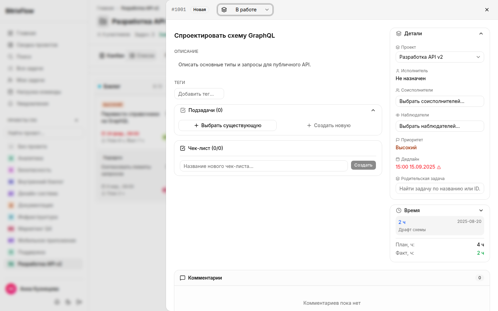
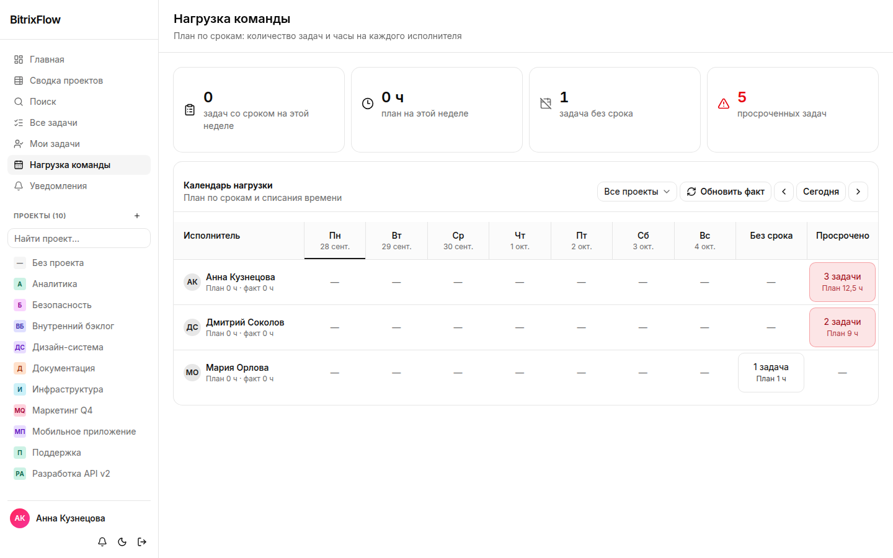
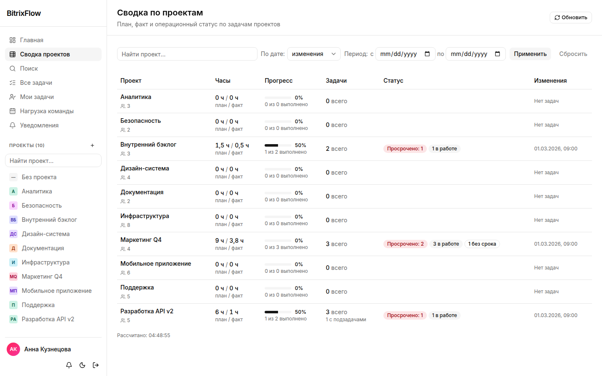
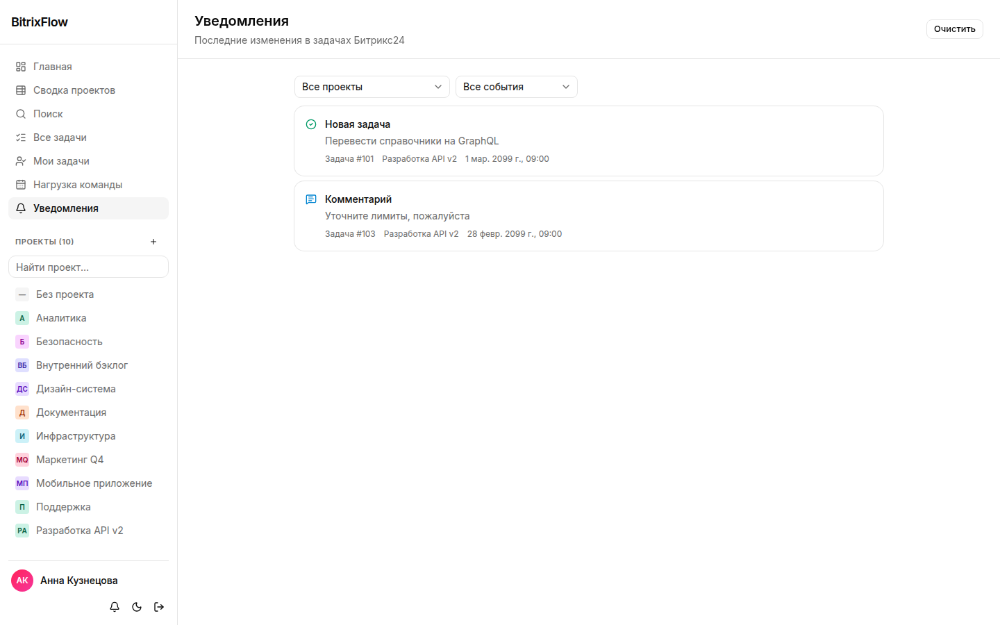
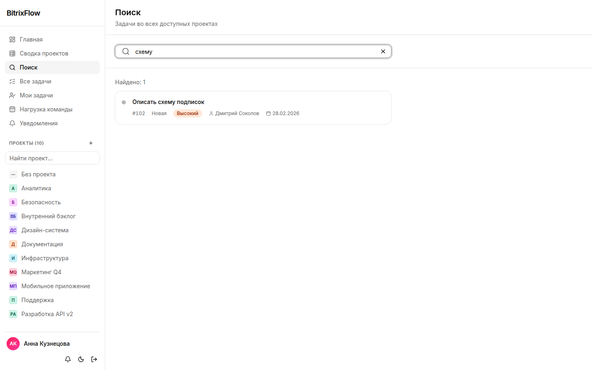

# Bitrix24 Kanban

Рабочее пространство для проектов и задач Bitrix24 в духе Asana. Приложение входит через
Bitrix24 OAuth, держит зеркало задач в MongoDB и принимает проверенные события задач для
фонового обновления.

Скрины ниже сняты на фиксированном наборе данных из UI-тестов (`MOCK_B24=1`, раздел
«UI-тесты» ниже), не на реальном портале: имена, проекты и задачи вымышленные.

## Экраны

**Главная**: счётчики просроченных задач и задач без дедлайна, проекты отсортированы:
самые просроченные наверху.



**Доска проекта**: канбан и список, прогресс по стадиям, план и факт часов.



**Карточка задачи**: описание, теги, подзадачи, чек-лист, учёт времени и комментарии.
Открывается поверх доски, а URL остаётся единственным источником правды для навигации
назад и вперёд.



**Нагрузка команды**: недельный календарь по исполнителям с отдельными блоками для
просроченных задач и задач без дедлайна.



**Сводка проектов**: план и факт часов, статус по каждому проекту, фильтр по периоду.



**Уведомления**: лента событий по задачам (новая задача, комментарий, смена статуса) с
фильтром по проекту и типу события, постраничная так же, как таблица задач.



**Поиск**: тот же поиск, что в таблице задач, только по всем проектам сразу.



## Локальный запуск

```bash
cp .env.example .env.local
npm ci
npm run dev
```

Заполни все обязательные значения в `.env.local`. Файл специально в `.gitignore`: не вставляй
токены, пароли, строки подключения к Mongo и боевые URL в issues или коммиты.

Для продакшена укажи публичный **HTTPS**-адрес в `BITRIX24_APP_URL` и
`BITRIX24_REDIRECT_URI`. Bitrix24 должен достучаться до `/api/b24/handler`, чтобы доставлять
события.

## Команды

```bash
npm run lint          # ESLint и правила Next.js
npm run format:check  # проверка Prettier
npm run format        # применить Prettier
npm test              # юнит-тесты
npm run build         # продакшен-сборка и проверка TypeScript
```

GitHub Actions гоняет все четыре проверки на пул-реквестах и на пуше в `main`.

## Продакшен

```bash
docker compose --env-file .env.local up -d --build
```

У MongoDB нет проброса порта на хост, она доступна только внутри сети Compose. Держи
`.env.local` в режиме `0600` на хосте. Сессионная кука приложения `HttpOnly`; записи сессий
на сервере хранятся в MongoDB в виде хэша, поэтому выход из аккаунта отзывает сессию именно
этого устройства.

## Перед публикацией на GitHub

1. Прогони `git status --ignored` и проверь, что `.env.local`, `.next` и `node_modules`
   игнорируются.
2. Прогони команды из раздела **Команды**.
3. Добавляй remote и делай push только после `git diff --cached`.
4. Значения для деплоя держи в секретах GitHub или хостинга, никогда в переменных
   репозитория или файлах воркфлоу.

### Бэкапы

```bash
./scripts/backup-mongo.sh          # дамп в ./backups, хранит 14 дней
KEEP_DAYS=30 ./scripts/backup-mongo.sh
```

Запускай по cron на хосте. `backups/` в `.gitignore`. Задай `BACKUP_PASSPHRASE` в
`.env.local`: дамп несёт OAuth-токены портала и хэши сессий, поэтому архив шифруется
AES-256, если фраза задана. Восстановление:

```bash
openssl enc -d -aes-256-cbc -pbkdf2 -iter 200000 -pass env:BACKUP_PASSPHRASE \
  -in backups/bitrix_kanban_<stamp>.gz.enc | \
  docker compose exec -T mongodb mongorestore --archive --gzip --drop \
  --username "$MONGO_USERNAME" --password "$MONGO_PASSWORD" --authenticationDatabase admin
```

### Ошибки и алерты

Ошибки и трейсы уходят в Sentry через `@sentry/nextjs`: сервер и edge через
`src/sentry.*.config.ts` и хук `onRequestError`, браузер через `src/instrumentation-client.ts`
и оба error boundary. Задай `SENTRY_DSN` в `.env.local`; без него отправка выключена, и
локальные запуски с тестами остаются тихими.

DSN также зашит в клиентский бандл на этапе сборки (build-arg `NEXT_PUBLIC_SENTRY_DSN`,
прописан в `docker-compose.yml`). Сорс-мапы загружаются, только если на сборке задан
`SENTRY_AUTH_TOKEN`; без него сборка всё равно проходит, просто стектрейсы будут указывать
на минифицированный код. `APP_RELEASE` помечает события релизом, передавай коммит:

```bash
APP_RELEASE=$(git rev-parse --short HEAD) docker compose --env-file .env.local up -d --build
```

Внешняя проверка доступности для cron на хосте (лучше с другой машины):

```bash
*/2 * * * * cd /path/to/bitrix-kanban && ./scripts/health-watch.sh >> backups/health.log 2>&1
```

Она дёргает `/api/health` и при падении шлёт событие `HealthCheckFailed` в тот же проект,
дальше алерт идёт обычным маршрутом.

### Если сайт отдаёт 502

Сервисам заданы фиксированные адреса в подсети `172.32.10.0/24`: docker DNS иногда
переставал резолвить имена контейнеров, и прокси ходит по адресу, а не по имени. Если
приложение при этом живо (`docker compose exec app wget -qO- localhost:3000/api/health`
отвечает `ok`), а сайт всё равно недоступен:

```bash
docker compose --env-file .env.local down && docker compose --env-file .env.local up -d
```

`scripts/health-watch.sh` делает это сам (не чаще раза в 15 минут) и шлёт алерт, только если
после пересоздания сайт так и не ответил.

### Здоровье и мониторинг

`GET /api/health` отвечает без сессии и пингует MongoDB, поэтому `docker compose ps` пишет
`healthy`, только пока приложение реально достаёт до базы. Compose перезапускает сервис
после трёх подряд неудачных проверок.

### Защита прокси

Caddy добавляет HSTS, `nosniff`, `Referrer-Policy` и политику `frame-ancestors`, которая
разрешает встраивание только в собственный origin приложения и порталы Bitrix24. Список
правится в `caddy/Caddyfile`, если приложению нужно работать внутри другого хоста.

### UI-тесты

```bash
./scripts/ui-tests-docker.sh                     # прогон как в CI
./scripts/ui-tests-docker.sh --update-snapshots  # обновить эталоны
npm run test:ui                                  # быстрый прогон в системном Chrome
```

Эталоны снимаются в образе `mcr.microsoft.com/playwright`, том же, что в CI: локальный
Chrome рисует шрифты чуть иначе, и попиксельное сравнение падало бы без единого изменения
в коде.

Тесты идут против сборки с `MOCK_B24=1` и отдельной базой `bitrix_kanban_test`: данные
фиксированные, поэтому скриншоты сравниваются попиксельно. Покрыты девять экранов в двух
вьюпортах (десктоп и телефон) плюс состояния: карточка задачи, фильтр с чипом, пустой
результат, диалог создания, тёмная тема, доска. Каждый экран заодно проверяется на ошибки
в консоли.

### Проверки интерфейса

Интерфейс проверяется axe-core (WCAG 2.1 A/AA плюс best practice) на вьюпортах 390px и
1440px, в светлой и тёмной теме. Порог: ноль нарушений. Элементам управления нужно
доступное имя, диалогам заголовок, а основной текст должен держать контраст 4.5:1.
